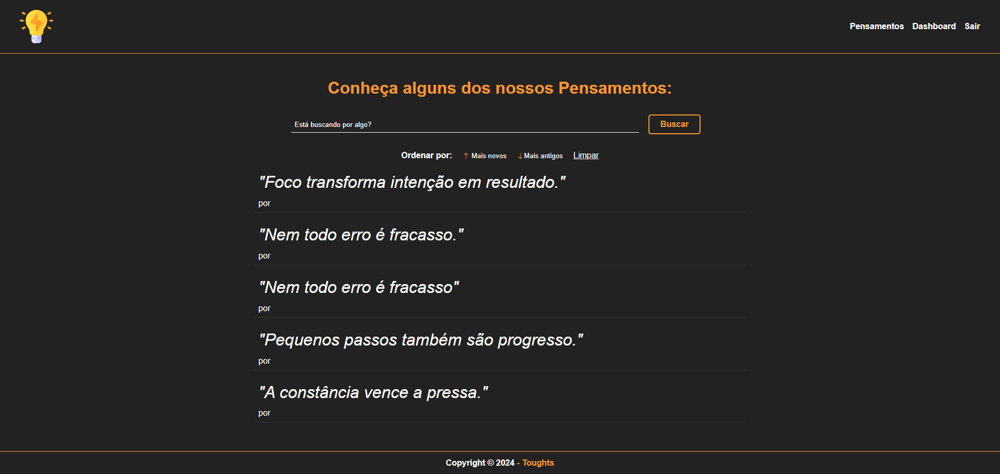

# 💡 Toughts - Aplicação de Pensamentos

Uma aplicação web full-stack para criar, compartilhar e descobrir pensamentos e reflexões com autenticação segura, busca avançada e filtros.

## 📸 Preview



## Funcionalidades

- ✅ **Autenticação Segura** - Registro e login de usuários com criptografia de senha (bcryptjs)
- ✅ **CRUD Completo** - Criar, ler, atualizar e deletar pensamentos
- ✅ **Busca Avançada** - Buscar pensamentos por título/conteúdo em tempo real
- ✅ **Ordenação Flexível** - Ordenar por mais novos ou mais antigos
- ✅ **Dashboard Pessoal** - Área exclusiva para gerenciar seus pensamentos
- ✅ **Edição e Exclusão** - Modifique ou delete seus pensamentos a qualquer momento
- ✅ **Gerenciamento de Sessão** - Controle de acesso baseado em sessões
- ✅ **Interface Responsiva** - Design moderno com Bootstrap Icons

## 🛠️ Stack Tecnológico

### Backend

- **Node.js** - Runtime JavaScript
- **Express.js** - Framework web
- **Sequelize** - ORM para banco de dados
- **MySQL** - Banco de dados relacional
- **bcryptjs** - Criptografia de senhas
- **express-session** - Gerenciamento de sessões
- **connect-flash** - Mensagens flash

### Frontend

- **Handlebars** - Template engine
- **Bootstrap Icons** - Ícones
- **CSS3** - Estilização

## 📋 Pré-requisitos

Antes de começar, você precisa ter instalado:

- [Node.js](https://nodejs.org/) (versão 14 ou superior)
- [MySQL](https://www.mysql.com/) (versão 5.7 ou superior)
- npm (gerenciador de pacotes do Node.js)

## 🔧 Instalação

### 1. Clone o repositório

```bash
git clone https://github.com/brnmilano/toughts-nodejs.git
cd toughts-nodejs
```

### 2. Instale as dependências

```bash
npm install
```

### 3. Configure o banco de dados

Crie um arquivo `.env` na raiz do projeto (ou configure as variáveis de ambiente):

```bash
DB_HOST=localhost
DB_USER=root
DB_PASSWORD=" "
DB_NAME=toughts
DB_PORT=3306
```

### 4. Crie o banco de dados

```bash
# Acesse o MySQL e execute:
CREATE DATABASE toughts;
```

### 5. Inicie o servidor

```bash
npm start
```

O servidor iniciará em `http://localhost:3000`

## 📖 Como Usar

### Registro de Novo Usuário

1. Clique em "Registrar" na página inicial
2. Preencha os dados: nome, email e senha
3. Clique em "Registrar"
4. Você será redirecionado para o login

### Login

1. Acesse a página de login
2. Digite seu email e senha
3. Clique em "Entrar"

### Dashboard

Após fazer login, você terá acesso ao dashboard onde pode:

- **Ver todos os seus pensamentos** criados
- **Editar** um pensamento existente
- **Deletar** pensamentos que não quer mais

### Criar um Pensamento

1. No dashboard, clique em "Criar Pensamento"
2. Preencha o título e a descrição
3. Clique em "Criar Pensamento"

### Buscar Pensamentos

1. Na homepage, use a barra de busca para procurar por palavras-chave
2. Use os filtros de ordenação:
   - **Mais novos** - Exibe os pensamentos mais recentes primeiro
   - **Mais antigos** - Exibe os pensamentos mais antigos primeiro
3. Clique em **Limpar** para resetar os filtros

### Logout

Clique em "Sair" no menu para encerrar sua sessão

## 📁 Estrutura do Projeto

```
toughts-nodejs/
├── controllers/          # Lógica da aplicação
│   ├── AuthController.js # Controle de autenticação
│   └── ToughtController.js # Controle de pensamentos
├── models/              # Modelos Sequelize
│   ├── User.js         # Modelo de usuário
│   └── Tought.js       # Modelo de pensamento
├── routes/             # Definição de rotas
│   ├── authRoutes.js   # Rotas de autenticação
│   └── toughtsRoutes.js # Rotas de pensamentos
├── views/              # Templates Handlebars
│   ├── auth/           # Páginas de autenticação
│   ├── toughts/        # Páginas de pensamentos
│   └── layouts/        # Layout principal
├── public/             # Arquivos estáticos
│   ├── css/            # Estilos CSS
│   └── img/            # Imagens
├── db/                 # Configuração do banco de dados
│   └── connection.js   # Conexão MySQL
├── helpers/            # Funções auxiliares
│   └── auth.js         # Validação de autenticação
├── sessions/           # Armazenamento de sessões
├── index.js            # Arquivo principal
└── package.json        # Dependências do projeto
```

## 🔐 Segurança

- Senhas são criptografadas com **bcryptjs**
- Sessões são armazenadas em arquivos para persistência
- Middleware de autenticação protege rotas privadas
- Cookies seguros com `httpOnly: true`

## 🌐 Rotas Principais

### Autenticação

- `GET /login` - Página de login
- `POST /login` - Processa login
- `GET /register` - Página de registro
- `POST /register` - Processa registro
- `GET /logout` - Faz logout do usuário

### Pensamentos

- `GET /` - Homepage com todos os pensamentos
- `GET /toughts/dashboard` - Dashboard do usuário
- `GET /toughts/create` - Página de criar pensamento
- `POST /toughts/create` - Processa criação
- `GET /toughts/edit/:id` - Página de editar pensamento
- `POST /toughts/edit/:id` - Processa edição
- `POST /toughts/delete/:id` - Deleta pensamento

## 📝 Variáveis de Ambiente

Configure as seguintes variáveis no arquivo `.env`:

```env
DB_HOST=localhost
DB_USER=root
DB_PASSWORD=password
DB_NAME=toughts
DB_PORT=3306
PORT=3000
SESSION_SECRET=nosso_secret
```

## 📄 Licença

Este projeto está sob a licença **MIT**. Veja o arquivo [LICENSE](LICENSE) para mais detalhes.

## 👨‍💻 Autor

**Bruno Milano**

- GitHub: [@brnmilano](https://github.com/brnmilano)
- Email: [brnmilano.dev@gmail.com](mailto:brnmilano.dev@gmail.com)
